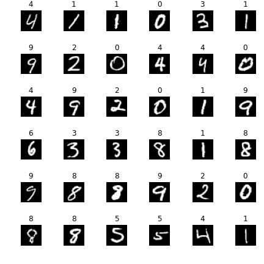
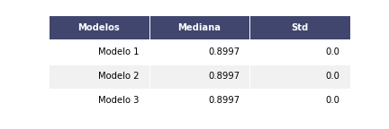
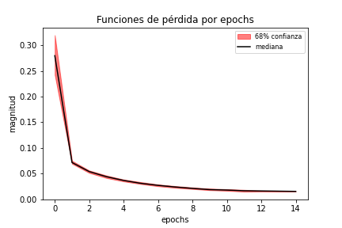
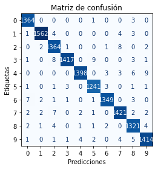
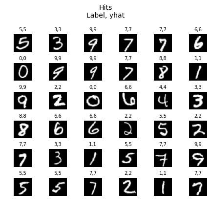
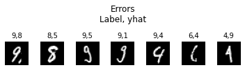

# Reconocimiento de dígitos mediante redes neuronales
Desarrollar un modelo mediante redes neuronales para la clasificación de dígitos.

## 1. Datos
Para el entrenamiento del modelo se usó la base de datos `The Mist Database` (http://yann.lecun.com/exdb/mnist/). Esta se encuentra divida en 60 mil imagénes de _training_ y 10 mil de _testing_. Para este proyecto se unira toda la base y se usará una propia división basado en el método `train_test_split` de `sklearn`.

Las imágenes son de 28x28 pixeles. Al ser transformadas en números, se vectorizan a 784 pixeles con valores entre 0-1. Cada columna será un pixel, y cada fila será una observación, de tal manera que el vector de explicativas es de 56 mil x 784.

  

## 2. Metodología
Se estimará tres modelos de redes neuronales que cuentan con las siguientes características:
* Layers intermedios tienen función de activación "relu" y la final es "linear". Esto debido a que la capa final linear será tranformada a probabilidades. La categoría que cuente con mayor probabilidad será la asignada como la estimada
* El algoritmo de optimización es Adam con un parámetro de aprendizaje de 0.001
* Se estimará cada uno de los modelos con 100 epochs
* Se comparará los resultados mediante la métrica MSE. Cada métrica se estimará 10 veces con diferentes valores iniciales. El modelo que cuente con la menor mediana de los MSE será el seleccionado

Los modelos, dadao diferentes arquitecturas neuronales, son los siguientes:
1. Modelo 1:
    * Layer0 = Insumos
    * Layer1 = 40 neuronas
    * Layer2 = 20 neuronas
    * Layer3 = 10 neuronas

2. Modelo 2:
    * Layer0 = Insumos
    * Layer1 = 60 neuronas
    * Layer2 = 30 neuronas
    * Layer3 = 20 neuronas
    * Layer4 = 10 neuronas  

3. Modelo 3:
    * Layer0 = Insumos
    * Layer1 = 20 neuronas
    * Layer2 = 20 neuronas
    * Layer3 = 15 neuronas
    * Layer4 = 15 neuronas 
    * Layer5 = 10 neuronas

## 3. Resultados
### 3.1 Selección de modelo
Tras la estimación de los modelos, los resultados se presentan a continuación:

  

Se encuentra que el modelo 2 cuenta con la menor mediana y con una de las menores desviaciones estándar entre las tres propuestas. De manera individual, también se encontró que en cada una de las diez iteraciones el MSE del modelo 2 era menor al de los demás modelos. Es por esto que se puede concluir, de manera robusta, que la arquitectura neuronal del modelo 2 cuenta con mejor ajuste que el de los demás, y será el seleccionado para las estimaciones.

### 3.2 Función de pérdida
La manera más concreta de entender si los resultados que se encuentran en el modelo 2 son robustos pese a los valores iniciales es, como se realizó previamente, estimar su MSE. De esta manera, podemos conseguir el error de la predicción de cada dígito dado la cantidad de epochs asignados.

No obstante, el MSE es una métrica final. Es decir, es un resultado concreto post estimación. Por su parte, la función de pérdida nos permite observar la dinámica de los errores por cada epoch. Dado el modelo seleccionado, se estimó 100 veces, cada una con un valor inicial tomado al azar. Los resultados de la mediana, bandas de confianza de 68% y 98% se pueden encontrar a continuación:

  

Como se observa, los resultados nuevamente son muy robustos. Pese a que se tome diferentes valores iniciales, la función de pérdida converge rápidamente a valores cercanos a cero y con alta confianza. Se puede concluir que el valor inicial no afectará a la estimación debido a que aún así se converge al valor real.
 
### 3.3 Predicciones
Se procede a estimar el modelo 2 con un valor inicial cualquiera. En este caso, se usó una de las semillas de los modelos ya estimados, la 150. La estimación se realizó mediante la muestra de train, y los resultados que se presentará a continuación son los asociados al de test. En líneas generales se encontró que el MSE entre ambos grupos son muy pequeños.

La función de confusión de las obseraciones de test son las siguientes:

  

Se encuentra que los errores son muy pocos, dado que la gran cantidad de la distribución de valores está en la diagonal, lo cual significa que se acertó a la etiqueta correcta.

Se puede observar las siguientes figuras con imágenes tomadas aleatoreamente con sus respectivas etiquetas y las etiquetas estimadas:

  

También se puede observar las figuras de aquellos dígitos que no lograron ser estimados. Al parecer la razón por la que la red neuronal falló al estimarlos es porque los dígitos fueron redactados en posiciones o formas que este tipo de redes neuronales no son capaces de entender, debido a sus limitaciones en cuanto a reconocer patrones:

  

## 4. Conclusiones
1. Modelo de clasificación de imágenes cuenta con gran ajuste en los sets de train y test. El margen de error es muy pequeño.
2. Resultados robustos a diferentes valores iniciales, tomados al azar.
3. Los errores encontrados son propios del uso de redes neuronales NO convolucionales. En este caso, el train parte del reconocimiento de pixeles y no de patrones, lo cual lo hace propio a buscar que los pixeles estén posicionados en la misma celda basado en cómo fueron entrenados.
  * Para este tipo de situaciones mejor usar redes neuronales convolucionales debido a que esas estructuras buscan patrones similares, y podrían reconocer dígitos pese a que en las imágenes hayan sido rotados levemente.
