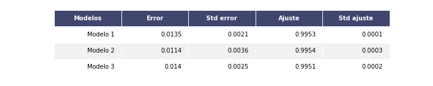

# Reconocimiento de dígitos mediante redes neuronales
Desarrollar un modelo mediante redes neuronales convolucionales para la clasificación de dígitos.

## 1. Datos
Para el entrenamiento del modelo se usó la base de datos [The Mist Database](http://yann.lecun.com/exdb/mnist/), pero que se encuentra disponible y procesado en [keras](https://keras.io/api/datasets/mnist/). Origialmente, está dividida en 60 mil imagénes de _training_ y 10 mil de _testing_. Para este proyecto se unirá toda la base y se usará una propia división basado en el método _train_test_split_. Las imágenes son de 28x28 pixeles. Al ser transformadas en números, se vectorizan a 784 pixeles con valores entre 0-1. Cada columna será un pixel, y cada fila será una observación, de tal manera que el vector de explicativas es de 56 mil x 784.

  

## 2. Metodología
Se estimará tres arquitecturas de redes neuronales convolucionales que cuentan con las siguientes consideraciones:
* Se cuenta con dos capas convolucionales, una de 32 y otra de 64 capas.
* Los layers Densos tienen función de activación "relu" y la final es "linear". Esto debido a que la capa final linear será tranformada a probabilidades. La categoría que cuente con mayor probabilidad será la asignada como la estimada
* El algoritmo de optimización es Adam con un parámetro de aprendizaje de 0.001
* Se estimará cada uno de los modelos con 100 epochs
* Se comparará los resultados mediante la métrica MSE. Cada métrica se estimará 10 veces con diferentes valores iniciales. El modelo que cuente con la menor mediana de los MSE será el seleccionado.
* Además de tener el menor error, se busca que el modelo también consiga el mejor ajuste.
* Cuando se alcance un 1% de error o 99.5% de ajuste, el modelo dejará de ser estimado.

Los modelos, dado diferentes arquitecturas neuronales, son los siguientes:
1. Arquitectura 1:
    * Convolucional = 32 capas
    * Pooling = 2x2
    * Convolucional = 64 capas
    * Pooling = 2x2
    * Layer1 = 40 neuronas
    * Layer2 = 20 neuronas
    * Layer3 = 10 neuronas

2. Arquitectura 2:
    * Convolucional = 32 capas
    * Pooling = 2x2
    * Convolucional = 64 capas
    * Pooling = 2x2
    * Layer1 = 60 neuronas
    * Layer2 = 30 neuronas
    * Layer3 = 20 neuronas
    * Layer4 = 10 neuronas  

3. Arquitectura 3:
    * Convolucional = 32 capas
    * Pooling = 2x2
    * Convolucional = 64 capas
    * Pooling = 2x2
    * Layer1 = 20 neuronas
    * Layer2 = 20 neuronas
    * Layer3 = 15 neuronas
    * Layer4 = 15 neuronas 
    * Layer5 = 10 neuronas

## 3. Resultados
### 3.1 Selección de modelo
Tras la estimación de los modelos, cada uno diez veces con diferentes valores iniciales, los errores y ajuste son los siguientes:

  

Dado que los resultados de los arquitecturas neuronales son muy similares, la arquitectura 2 cuenta con la menor mediana en errores y también la mayor en ajuste. Además, los resultados son ligeramente menos dispersos entre sí, evidenciado por una menor desviación estándar entre las tres propuestas. De manera individual, también se encontró que en cada una de las siete de las diez iteraciones el MSE de la arquitectura 2 era menor al de los demás arquitecturas, lo cual muestra que los resultados son robustos y seleccionan la arquitectura 2 como el mejor en términos de menor error y mayor ajuste.

### 3.2 Función de pérdida
La manera más concreta de entender si los resultados que se encuentran en la arquitectura 2 son robustos pese a los valores iniciales es, como se realizó previamente, estimar su MSE bajo diferentes valores iniciales. No obstante, el MSE es una métrica final, post estimación. Por su parte, la función de pérdida nos permite observar la dinámica de los errores por cada epoch. Dado la arquitectura seleccionada, se estimó 50 veces, cada una con un valor inicial tomado al azar. Los resultados de la mediana y bandas de confianza de 68% se pueden encontrar a continuación:

  

Como se observa, los resultados nuevamente son muy robustos. Pese a que se tome diferentes valores iniciales, la función de pérdida converge rápidamente a valores cercanos a cero y con alta confianza. De hecho, en cada una de las 50 iteraciones se demoró como máximo 14 epochs en conseguir la convergencia a 1% de error o a 99.5% de ajuste. Se puede concluir que el valor inicial no afectará a la estimación debido a que aún así se converge.
 
### 3.3 Predicciones
Dado que se demostró que con cualquier valor inicial tomado al azar se converge, se procede a recuperar alguno que fue estimado con la arquitectura 2. En este caso, se usó el set de valores inicial de semilla 1000, previamente ya estimada. Los resultados mostrados a continuación son los asociados al set de test. La función de confusión de las observaciones de test son las siguientes:

  

Se encuentra que los errores son muy pocos, dado que la gran cantidad de la distribución de valores está en la diagonal. Evidentemente, se acertó a la etiqueta correcta en casi todas las imágenes con un error de 1%.

### 3.4 Aciertos y desaciertos
Las siguientes imágenes fueron tomadas aleatoreamente con sus respectivas etiquetas y las etiquetas estimadas para los casos de aciertos:

  

También se puede observar las figuras de aquellos dígitos de desaciertos:
   

  

Al parecer, la razón por la que la red neuronal falló al estimarlos es por la poca claridad en la redacción, más no por un error en la estructura. De hecho, al considerar las capas convolucionales se evita que los resultados puedan ser alterados ante cambios en posiciones y rotaciones. 

## 4. Conclusiones
1. Modelo de clasificación de imágenes cuenta con gran ajuste en los sets de train y test. El margen de error es muy pequeño.
2. Resultados robustos a diferentes valores iniciales, tomados al azar.
3. Los errores encontrados son por poca claridad en la redacción. La red neuronal contemplan posibles rotaciones o cambios en posición, debido a la inclusión de capas convolucionales.