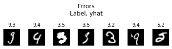

# Reconocimiento de dígitos mediante redes neuronales
Desarrollar un modelo mediante redes neuronales para la clasificación de dígitos.

## 1. Datos
Para el entrenamiento del modelo se usó la base de datos `The Mist Database` (http://yann.lecun.com/exdb/mnist/). Esta se encuentra divida en 60 mil imagénes de _training_ y 10 mil de _testing_. Para este proyecto se unira toda la base y se usará una propia división basado en el método `train_test_split` de `sklearn`.

Las imágenes son de 28x28 pixeles. Al ser transformadas en números, se vectorizan a 784 pixeles con valores entre 0-1. Cada columna será un pixel, y cada fila será una observación, de tal manera que el vector de explicativas es de 56 mil x 784.

  

## 2. Metodología
(((Estructuras)))

## 3. Resultados
### 3.1 Selección de modelo

  

### 3.2 Función de pérdida

  

### 3.3 Predicciones

  

  

  

## 4. Conclusiones
1. Modelo de clasificación de imágenes cuenta con gran ajuste en los sets de train y test. El margen de error es muy pequeño.
2. Resultados robustos a diferentes valores iniciales, tomados al azar.

## 5. Agenda
1. Dibujo de dígito que no coincida con las dimensiones del entrenamiento para demostrar que el modelo no performa bien sin capas convulsionales.
